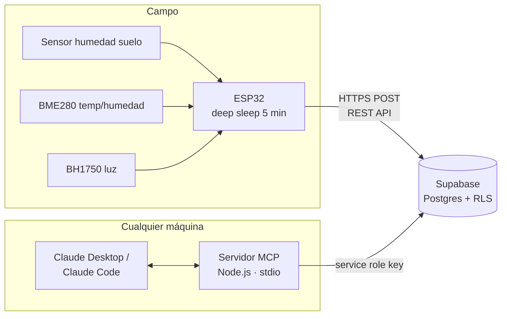

# 🌱 AgroSensor OGB — Agricultura de Precisión

Sistema de agricultura de precisión basado en **ESP32 + Supabase + MCP**, diseñado para monitoreo de cultivos en Oaxaca (agave, hortalizas, milpa).

> **Este repositorio es documentación pura.** Contiene la especificación completa, diagramas y el prompt para que **Claude Code** genere e implemente el código en cualquier máquina. El servidor MCP corre **localmente vía stdio** en cualquier equipo (laptop, PC, VPS opcional) — no requiere infraestructura dedicada.

## Arquitectura en un vistazo



## Contenido

| Documento | Descripción |
|---|---|
| [docs/01-arquitectura.md](docs/01-arquitectura.md) | Arquitectura general, flujo de datos, decisiones de diseño |
| [docs/02-hardware.md](docs/02-hardware.md) | BOM, diagrama de conexiones, alimentación solar |
| [docs/03-firmware.md](docs/03-firmware.md) | Especificación del firmware ESP32 (PlatformIO) |
| [docs/04-supabase.md](docs/04-supabase.md) | Esquema SQL, políticas RLS, seguridad de llaves |
| [docs/05-mcp-server.md](docs/05-mcp-server.md) | Servidor MCP portable (stdio) y sus 7 herramientas de análisis |
| [docs/06-prompt-claude-code.md](docs/06-prompt-claude-code.md) | Prompt listo para copiar en Claude Code |
| [supabase/001_schema.sql](supabase/001_schema.sql) | Migración SQL lista para ejecutar |

## Filosofía del proyecto

1. **Costo cero de infraestructura**: Supabase free tier + MCP local. Nada que mantener 24/7.
2. **Portable**: el MCP corre en cualquier máquina con Node.js 20+. Se conecta a Claude Desktop o Claude Code con 4 líneas de configuración.
3. **Seguro por diseño**: el ESP32 solo puede *insertar* lecturas (RLS). La llave `service_role` nunca sale de la máquina de análisis.
4. **Documentación primero**: todo el sistema está especificado aquí antes de escribir una línea de código. Claude Code implementa a partir de esta spec.

## Quick start

```bash
# 1. Crea el proyecto en Supabase y ejecuta supabase/001_schema.sql
# 2. En cualquier máquina con Node.js y Claude Code:
claude
# 3. Pega el prompt de docs/06-prompt-claude-code.md
```

## Licencia

MIT — Omar García Brena · OGB Consulting
