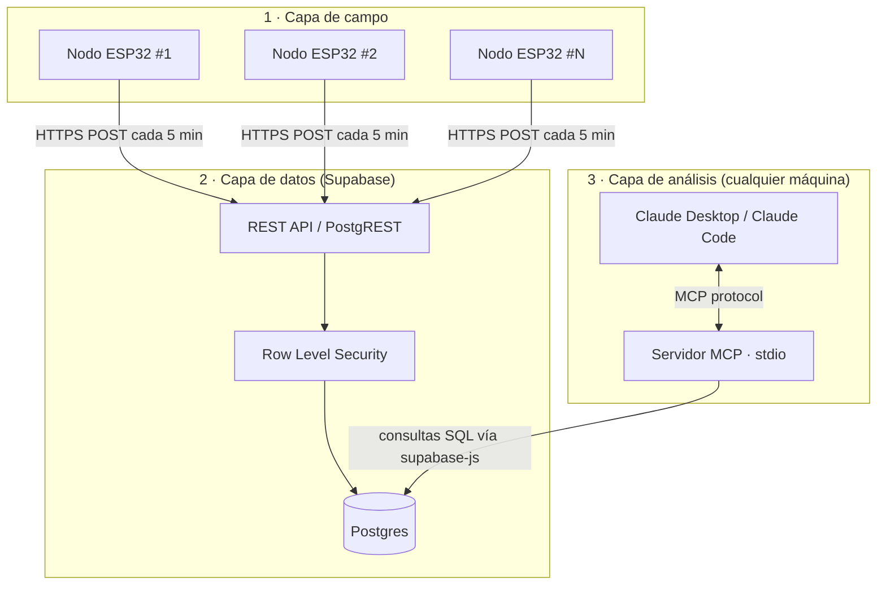
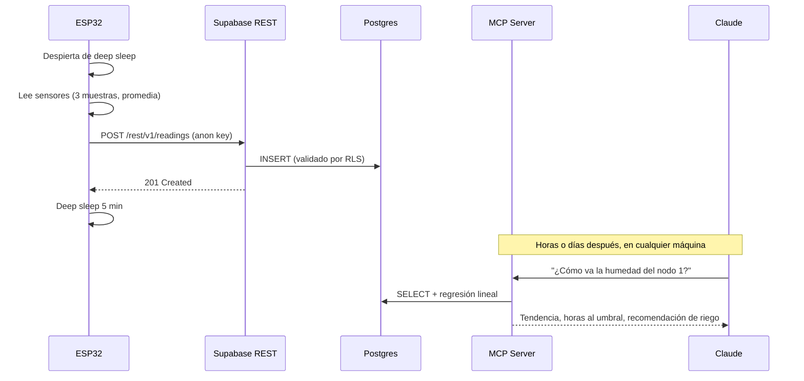
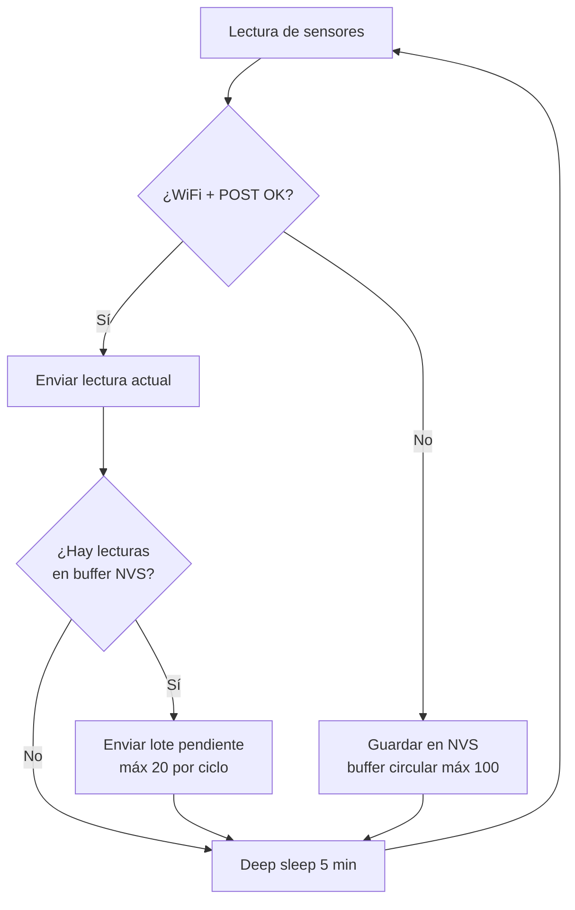

# 01 · Arquitectura

## Visión general

Tres capas desacopladas. Cada una puede evolucionar sin tocar las otras.

## Flujo de una lectura

## Manejo de fallas de red (buffer offline)

## Decisiones de diseño

| Decisión | Alternativa descartada | Razón |
|---|---|---|
| MCP local por **stdio** | MCP remoto HTTP/SSE en VPS | Cero infraestructura, cero superficie de ataque, corre en cualquier máquina. El análisis no necesita estar disponible 24/7 — los datos sí, y de eso se encarga Supabase. |
| ESP32 → Supabase **directo** | Edge Function intermedia | Menos partes móviles. RLS de solo-insert acota el riesgo de la anon key expuesta en firmware. |
| **Deep sleep** 5 min | Lectura continua | La humedad del suelo cambia en horas, no en segundos. Consumo ~10 µA dormido → meses con batería. |
| Sensor **capacitivo** | Sensor resistivo | El resistivo se corroe en semanas por electrólisis. |
| Timestamps **del servidor** (`default now()`) | Reloj del ESP32 | Evita depender de NTP en campo. Con lecturas cada 5 min, el error de segundos es irrelevante. Las lecturas del buffer offline incluyen `offline_delay_s` para reconstruir el tiempo real aproximado. |

## Escalabilidad futura (fuera de alcance inicial)

- Dashboard PWA en GitHub Pages leyendo Supabase con anon key + política RLS de lectura pública.
- LoRa/ESP-NOW para nodos sin cobertura WiFi (un nodo gateway).
- Migración del MCP a VPS con transporte HTTP/SSE **solo si** se necesita acceso multi-usuario o cron de alertas 24/7 — la spec del servidor no cambia, solo el transporte.
