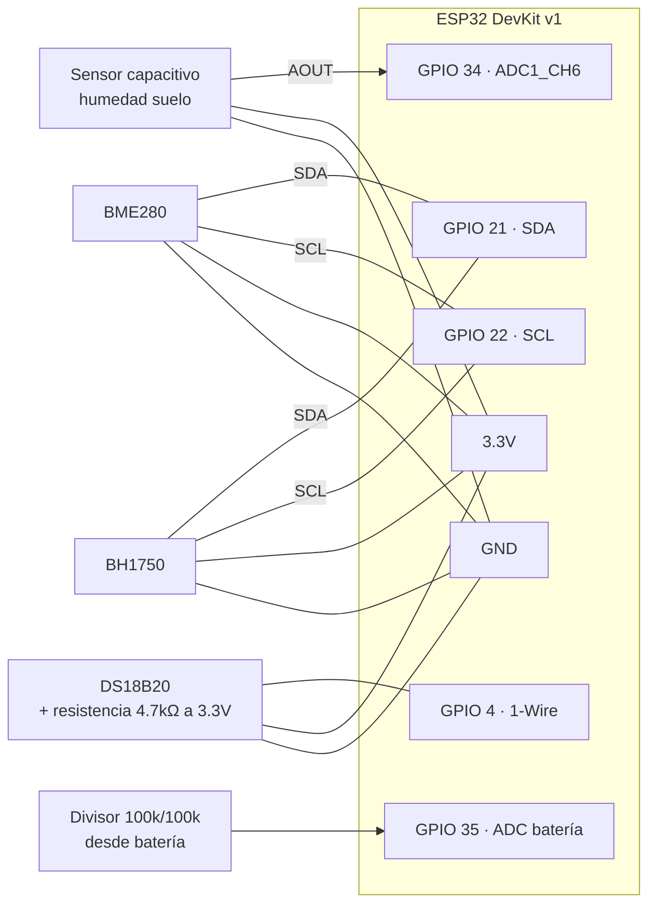
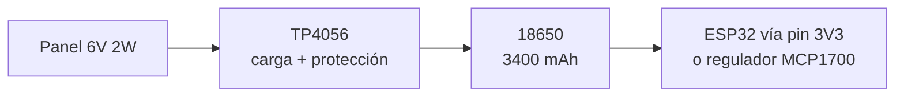

# 02 · Hardware

## Lista de materiales (BOM)

| # | Componente | Modelo | Precio aprox. MXN | Notas |
|---|---|---|---|---|
| 1 | MCU | ESP32 DevKit v1 (WROOM-32) | $120 | WiFi integrado, deep sleep ~10 µA |
| 2 | Humedad de suelo | Capacitivo v1.2 | $45 | **NO resistivo** — se corroe por electrólisis |
| 3 | Temp/humedad ambiente | BME280 (I2C) | $90 | Preferido sobre DHT22: más preciso, menos fallas |
| 4 | Luz | BH1750 (I2C) | $50 | Lux calibrado, mejor que LDR |
| 5 | Temp. de suelo (opcional) | DS18B20 impermeable | $55 | 1-Wire |
| 6 | Panel solar (opcional) | 6V 2W | $80 | Para nodo autónomo |
| 7 | Cargador (opcional) | TP4056 con protección | $25 | |
| 8 | Batería (opcional) | 18650 3400 mAh | $90 | |
| 9 | Caja | IP65 | $70 | Sensor de suelo sale por prensaestopa |

**Total nodo básico (1-4):** ~$305 MXN · **Nodo autónomo solar completo:** ~$625 MXN

## Diagrama de conexiones

## Tabla de pines

| Señal | GPIO | Tipo | Notas |
|---|---|---|---|
| Humedad suelo (AOUT) | 34 | ADC1_CH6 | Solo entrada. Usar ADC1 (ADC2 falla con WiFi activo) |
| I2C SDA | 21 | I2C | BME280 (0x76) y BH1750 (0x23) comparten bus |
| I2C SCL | 22 | I2C | |
| DS18B20 | 4 | 1-Wire | Pull-up 4.7 kΩ a 3.3V |
| Voltaje batería | 35 | ADC1_CH7 | Divisor 1:2 — leer ×2 en firmware |

## Alimentación solar (nodo autónomo)

> **Importante:** alimentar el ESP32 por el pin 5V/VIN desde la 18650 desperdicia energía en el regulador AMS1117 de la DevKit (quiescent ~5 mA, mata el deep sleep). Para autonomía real usar un regulador LDO de bajo quiescent (MCP1700-3302, ~1.6 µA) directo al pin 3V3.

## Calibración del sensor de humedad

Cada sensor capacitivo es distinto. Calibrar **por nodo** y guardar en la tabla `nodes` de Supabase:

1. **Seco (aire):** leer ADC con el sensor al aire → `soil_dry_adc` (típico ~3200)
2. **Húmedo (agua):** sumergir hasta la línea → `soil_wet_adc` (típico ~1200)
3. El firmware mapea linealmente: `humedad % = 100 × (dry − raw) / (dry − wet)`, acotado a [0, 100]

## Colocación en campo

- Sensor de suelo a **profundidad de raíz** del cultivo (agave: 20–30 cm; hortalizas: 10–15 cm)
- No colocar junto a goteros — mide zona representativa, no el punto más húmedo
- BME280 a la sombra, con ventilación (dentro de la caja con rejilla, no al sol directo)
- Antena del ESP32 orientada hacia el punto de acceso WiFi; probar RSSI antes de fijar
