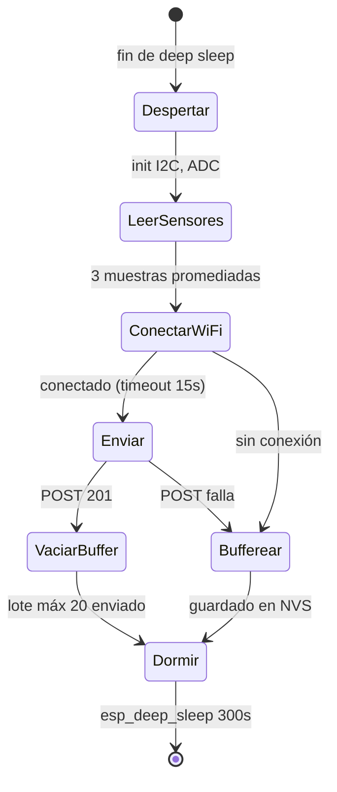

# 03 · Firmware ESP32 — Especificación

**Stack:** PlatformIO · framework Arduino · C++

## Ciclo de operación



## Requisitos funcionales

| ID | Requisito |
|---|---|
| F1 | Despertar cada **5 min** (configurable en `config.h` como `SLEEP_SECONDS`) |
| F2 | Leer cada sensor **3 veces con 200 ms entre muestras** y promediar |
| F3 | Descartar lecturas fuera de rango físico: temp aire −10 a 55 °C, humedad 0–100 %, lux 0–120 000, ADC suelo 500–4095. Si las 3 muestras son inválidas → enviar `null` en ese campo |
| F4 | Mapear ADC de suelo a % con constantes de calibración por nodo (`SOIL_DRY_ADC`, `SOIL_WET_ADC` en `config.h`) |
| F5 | POST a `{SUPABASE_URL}/rest/v1/readings` con headers `apikey`, `Authorization: Bearer {ANON_KEY}`, `Content-Type: application/json`, `Prefer: return=minimal` |
| F6 | Si el POST falla: guardar el payload en **NVS (Preferences)** como buffer circular de **máx 100 lecturas** |
| F7 | Al recuperar conexión: enviar buffer en lotes de máx 20 por ciclo (PostgREST acepta arrays JSON en un solo POST) |
| F8 | Cada lectura buffereada incluye `offline_delay_s`: segundos transcurridos desde su captura (contados en ciclos de sleep), para que el análisis reconstruya el timestamp aproximado |
| F9 | Leer voltaje de batería en GPIO 35 (divisor 1:2) y reportar como `battery_v` |
| F10 | Timeout total del ciclo despierto: **30 s máx**. Pase lo que pase, dormir |

## Requisitos no funcionales

- **Sin credenciales en git:** WiFi y llaves en `include/secrets.h` (gitignoreado). Incluir `secrets.h.example`.
- **Consumo:** WiFi apagado hasta después de leer sensores. `WiFi.mode(WIFI_OFF)` antes de dormir.
- **Logs:** `Serial` solo si `DEBUG=1` en `config.h` (en producción, apagado ahorra tiempo despierto).

## Payload

```json
{
  "node_id": "nodo-01",
  "soil_moisture": 42.5,
  "air_temp": 26.8,
  "air_humidity": 55.2,
  "light_lux": 18500,
  "soil_temp": 21.3,
  "battery_v": 3.92,
  "offline_delay_s": 0
}
```

## Estructura del repo de firmware

```
agro-esp32/
├── platformio.ini          # board: esp32dev, monitor_speed: 115200
├── include/
│   ├── config.h            # SLEEP_SECONDS, calibración, DEBUG, pines
│   └── secrets.h.example   # WIFI_SSID, WIFI_PASS, SUPABASE_URL, SUPABASE_ANON_KEY, NODE_ID
├── src/
│   └── main.cpp
├── docs/
│   └── calibracion.md      # procedimiento seco/húmedo paso a paso
├── .gitignore              # include/secrets.h
└── README.md
```

## Librerías (platformio.ini)

```ini
lib_deps =
    adafruit/Adafruit BME280 Library
    claws/BH1750
    milesburton/DallasTemperature
    paulstoffregen/OneWire
    bblanchon/ArduinoJson@^7
```
