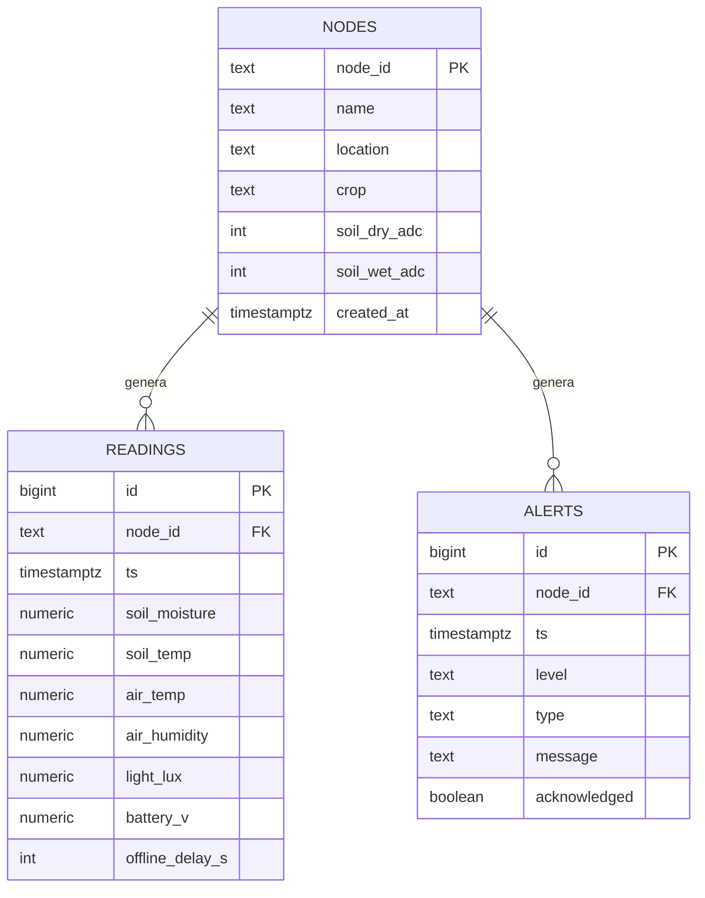
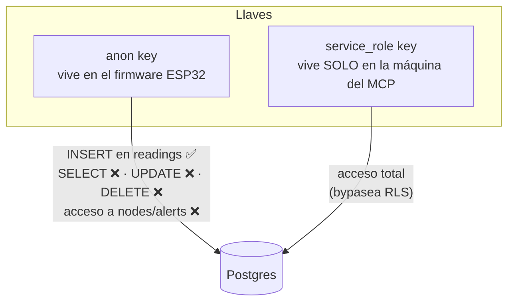

# 04 · Supabase — Base de datos

## Modelo de datos

El SQL completo está en [`supabase/001_schema.sql`](../supabase/001_schema.sql) — se ejecuta una vez en el SQL Editor de Supabase.

## Modelo de seguridad (RLS)

**Por qué esto es seguro aunque la anon key esté en el firmware:**

- Lo peor que puede hacer alguien que extraiga la anon key del ESP32 es *insertar lecturas falsas*. No puede leer datos, ni borrarlos, ni tocar otras tablas.
- La `service_role` key nunca se embebe en hardware ni se sube a git — vive en un `.env` en la máquina donde corre el MCP.
- Si la anon key se compromete y hay spam de inserts: rotar la llave en Supabase y reflashear los nodos. Con pocos nodos es un procedimiento de minutos.

## Free tier de Supabase — ¿alcanza?

| Recurso | Límite free | Consumo estimado |
|---|---|---|
| Base de datos | 500 MB | 1 nodo cada 5 min ≈ 105k lecturas/año ≈ **~15 MB/año**. Alcanza para 10+ nodos por años |
| API requests | Ilimitadas (fair use) | 288 POST/día por nodo — trivial |
| Pausa por inactividad | Proyecto se pausa tras 7 días sin actividad | **No aplica**: los nodos hacen requests constantes |

## Mantenimiento

- **Retención:** opcionalmente, agregar un job (pg_cron, disponible en Supabase) que agregue lecturas > 6 meses a promedios horarios y borre el detalle. No necesario al inicio.
- **Backup:** free tier no incluye backups automáticos → el MCP incluye la herramienta `export_data` para dumps periódicos a CSV local.
