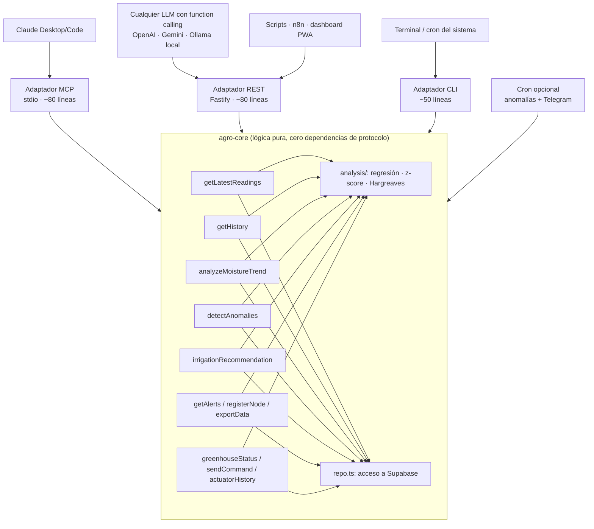
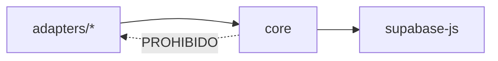

# 05 · Capa de Análisis — Núcleo Agnóstico + Adaptadores

**Principio de diseño:** toda la lógica de análisis vive en un **núcleo TypeScript puro** (`agro-core`) que no sabe nada de MCP. El MCP es solo **un adaptador delgado** entre varios. Si mañana MCP desaparece, cambia de versión, o quieres usar otro LLM, otra interfaz u otro protocolo, el núcleo no se toca.



## Contrato del núcleo

Cada función del núcleo es **pura respecto al protocolo**: recibe parámetros tipados, devuelve un objeto JSON serializable, lanza errores tipados. Nada de formatos MCP, nada de HTTP.

```typescript
// agro-core/src/index.ts — la interfaz pública completa
export interface AgroCore {
  getLatestReadings(nodeId?: string): Promise<Reading[]>
  getHistory(nodeId: string, hours: number): Promise<HistoryStats>
  analyzeMoistureTrend(nodeId: string, days?: number): Promise<TrendResult>
  detectAnomalies(nodeId?: string, days?: number): Promise<Anomaly[]>
  irrigationRecommendation(nodeId: string): Promise<IrrigationAdvice>
  getAlerts(acknowledged?: boolean): Promise<Alert[]>
  registerNode(node: NodeInput): Promise<Node>
  exportData(nodeId?: string, days?: number): Promise<{ csvPath: string }>
  // Invernadero (doc 07)
  greenhouseStatus(nodeId: string): Promise<GreenhouseStatus>
  sendCommand(nodeId: string, actuator: Actuator, action: Action, durationS?: number): Promise<Command>
  actuatorHistory(nodeId: string, days?: number): Promise<ActuatorUsage[]>
}

export function createCore(config: { supabaseUrl: string; serviceRoleKey: string }): AgroCore
```

Las **reglas de análisis** (regresión lineal, z-score > 3, sensores congelados ≥ 12 ciclos, gaps > 30 min, deduplicación de alertas 6 h, umbrales por cultivo, Hargreaves simplificado) viven en `agro-core/src/analysis/` y están detalladas al final de este documento.

## Adaptadores

### 1. MCP (stdio) — para Claude Desktop / Claude Code

Mapea 1:1 cada función del núcleo a una tool MCP. Solo traduce: JSON Schema de entrada → llamada al core → resultado como texto/JSON.

```typescript
// adapters/mcp.ts (esquema)
server.tool("analyze_moisture_trend", schema, async (args) =>
  toText(await core.analyzeMoistureTrend(args.node_id, args.days)))
```

Registro en Claude Code:
```bash
claude mcp add agro -e SUPABASE_URL=... -e SUPABASE_SERVICE_ROLE_KEY=... -- node dist/adapters/mcp.js
```

### 2. REST — para cualquier otro cliente

Fastify con un endpoint por función: `GET /nodes/:id/trend?days=3`, `POST /commands`, etc. Auth por header `x-api-key`. Con esto el sistema funciona con:
- **Cualquier LLM con function calling** (OpenAI, Gemini, Ollama local con llama3): se le da el spec OpenAPI que el adaptador autogenera en `/openapi.json`
- **n8n / Make / scripts** para automatizaciones
- El futuro **dashboard PWA**

```bash
node dist/adapters/rest.js   # puerto 3010, opcional
```

### 3. CLI — para terminal y cron del sistema

```bash
agro trend nodo-01 --days 3
agro anomalies --all          # ideal para crontab: alerta a Telegram si hay críticas
agro riega invernadero-01 --min 10
```

## Regla de dependencias



- `core` **no importa nada** de `adapters/` ni de `@modelcontextprotocol/sdk` ni de Fastify.
- Un adaptador nuevo (Telegram bot, WhatsApp, gRPC, lo que sea) son ~80 líneas sin tocar el core.
- Los tests unitarios corren contra el core directo, sin levantar ningún servidor.

## Estructura del repo

```
agro-mcp/                     # (nombre histórico; es la capa de análisis completa)
├── package.json              # scripts: build, mcp, rest, cli
├── tsconfig.json
├── .env.example
├── src/
│   ├── core/
│   │   ├── index.ts          # createCore() — la interfaz de arriba
│   │   ├── repo.ts           # todas las queries a Supabase
│   │   ├── types.ts
│   │   └── analysis/
│   │       ├── regression.ts
│   │       ├── anomalies.ts
│   │       └── et0.ts
│   └── adapters/
│       ├── mcp.ts
│       ├── rest.ts
│       └── cli.ts
└── test/core/                # tests del núcleo, sin protocolo
```

## Reglas de análisis (contrato de implementación)

**`analyzeMoistureTrend`** — Regresión lineal simple sobre `(ts, soil_moisture)` de los últimos `days` (default 3). Si pendiente < −0.05 %/h: `horas_al_umbral = (actual − umbral_cultivo) / |pendiente|`. Si no: estado "estable o subiendo".

**`detectAnomalies`** — Z-score > 3 por variable en ventana móvil (ignorar stddev ≈ 0) · valor idéntico ±0.01 durante ≥ 12 lecturas → `sensor_anomaly` · gap entre lecturas > 30 min → `node_offline` (info < 2 h, warning después) · `battery_v < 3.4` → `low_battery`. Antes de insertar en `alerts`: verificar que no exista alerta abierta del mismo `type`+`node_id` en las últimas 6 h.

**`irrigationRecommendation`** — Umbrales por cultivo: agave 20 %, hortalizas 40 %, milpa 35 %, default 30 %. ET₀ Hargreaves con min/max de `air_temp` del día; ET₀ alta + tendencia negativa adelanta la recomendación.

**`sendCommand`** — Inserta en `commands` con `status='pending'`. Valida actuador ∈ {pump, fan, extractor} y action ∈ {on, off, auto}. Marca `expired` los comandos `pending` con > 10 min de antigüedad antes de insertar uno nuevo.

**`actuatorHistory`** — Suma de tiempo encendido por actuador por día a partir de `actuator_log` (pares ON→OFF). Señala días con riego > 2× la mediana como posible fuga o sensor fallido.
