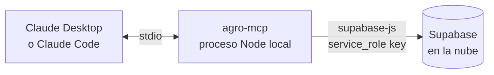

# 05 · Servidor MCP de Análisis — Portable (stdio)

**Stack:** Node.js 20+ · TypeScript · `@modelcontextprotocol/sdk` · `@supabase/supabase-js`

El servidor corre en **cualquier máquina** (laptop Windows/Mac/Linux, mini PC, o un VPS si algún día se quiere). Se conecta a Claude Desktop o Claude Code por **stdio** — sin puertos abiertos, sin dominios, sin Docker obligatorio.



## Herramientas (tools)

| # | Tool | Entrada | Salida |
|---|---|---|---|
| 1 | `get_latest_readings` | `node_id?` | Última lectura por nodo, con edad de la lectura ("hace 4 min") |
| 2 | `get_history` | `node_id, hours` | Estadísticas (min/max/avg/stddev por variable). Si `hours ≤ 48`, incluye la serie completa |
| 3 | `analyze_moisture_trend` | `node_id, days=3` | Pendiente de humedad (regresión lineal), horas estimadas para llegar al umbral crítico (30 % default), interpretación en texto |
| 4 | `detect_anomalies` | `node_id?, days=2` | Z-score > 3 en ventana móvil · sensor congelado (misma lectura ≥ 12 ciclos) · gap de transmisión > 30 min · `battery_v < 3.4`. Inserta hallazgos en `alerts` |
| 5 | `irrigation_recommendation` | `node_id` | Combina humedad actual + tendencia + evapotranspiración simplificada (Hargreaves con temp y humedad ambiente) + cultivo del nodo → regar/no regar, cuándo y cuánto (cualitativo) |
| 6 | `get_alerts` | `acknowledged?=false` | Lista de alertas, agrupadas por nodo y nivel |
| 7 | `register_node` | `node_id, name, location, crop, soil_dry_adc, soil_wet_adc` | Alta/actualización de nodo |
| 8 | `export_data` | `node_id?, days=30` | Dump a CSV en `./exports/` — sirve de backup del free tier |

## Reglas de análisis (detalle para implementación)

**Tendencia de humedad (tool 3):**
- Regresión lineal simple sobre `(ts, soil_moisture)` de los últimos `days` días.
- `horas_al_umbral = (humedad_actual − umbral) / |pendiente_por_hora|` — solo si la pendiente es negativa.
- Si la pendiente es positiva o ~0 (|m| < 0.05 %/h): reportar "estable o subiendo, sin riego próximo".

**Anomalías (tool 4):**
- Z-score por variable contra media/stddev de la ventana. Ignorar variables con stddev ≈ 0.
- Sensor congelado: valor idéntico (±0.01) durante ≥ 12 lecturas consecutivas → `sensor_anomaly`.
- Gap: diferencia entre lecturas consecutivas > 30 min → `node_offline` (info si < 2 h, warning si más).
- No duplicar alertas: antes de insertar, verificar que no exista alerta abierta (`acknowledged=false`) del mismo `type` + `node_id` en las últimas 6 h.

**Riego (tool 5):**
- Umbrales por cultivo (tabla en código, editable): agave 20 %, hortalizas 40 %, milpa 35 %, default 30 %.
- ET₀ simplificada Hargreaves: usa `air_temp` min/max del día. Alta ET₀ + tendencia negativa → adelantar recomendación.

## Configuración en Claude Desktop

`claude_desktop_config.json`:

```json
{
  "mcpServers": {
    "agro": {
      "command": "node",
      "args": ["/ruta/a/agro-mcp/dist/index.js"],
      "env": {
        "SUPABASE_URL": "https://xxxx.supabase.co",
        "SUPABASE_SERVICE_ROLE_KEY": "eyJ..."
      }
    }
  }
}
```

## Configuración en Claude Code

```bash
claude mcp add agro -e SUPABASE_URL=https://xxxx.supabase.co -e SUPABASE_SERVICE_ROLE_KEY=eyJ... -- node /ruta/a/agro-mcp/dist/index.js
```

## Estructura del repo

```
agro-mcp/
├── package.json            # bin: dist/index.js — permite npx si se publica
├── tsconfig.json           # strict: true
├── .env.example            # SUPABASE_URL, SUPABASE_SERVICE_ROLE_KEY
├── .gitignore              # .env, dist/, exports/, node_modules/
├── src/
│   ├── index.ts            # McpServer + StdioServerTransport
│   ├── supabase.ts         # cliente singleton
│   ├── tools/              # un archivo por tool (8 archivos)
│   └── analysis/
│       ├── regression.ts   # regresión lineal
│       ├── anomalies.ts    # z-score, congelados, gaps
│       └── et0.ts          # Hargreaves simplificado
└── README.md
```

## Requisitos no funcionales

- **Errores nunca tiran el proceso:** cada tool con try/catch, devuelve error como texto legible al modelo.
- **Sin estado local** (excepto `exports/`): todo vive en Supabase.
- **Respuestas compactas:** las tools devuelven resúmenes interpretables, no dumps crudos de miles de filas.
