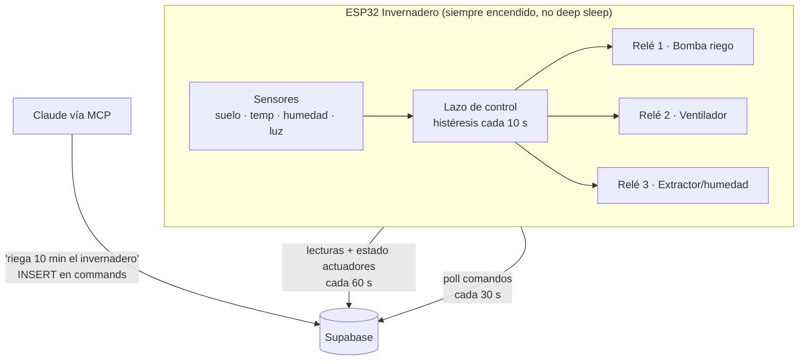
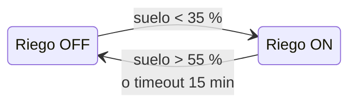
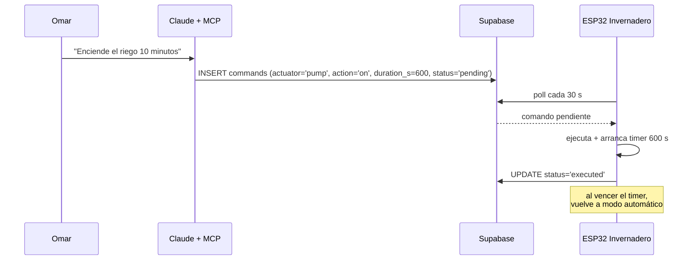

# 07 · Invernadero Inteligente — Control de Actuadores

Extensión del sistema: además de **medir**, el ESP32 del invernadero **actúa** — riego, ventilación y extractor — con control automático por histéresis y anulación manual desde Claude (vía Supabase).

## Arquitectura de control

**Diferencia clave con el nodo de campo:** el invernadero tiene corriente (los relés la necesitan), así que **no usa deep sleep** — corre un lazo continuo y además puede recibir órdenes.

## Lógica de control (histéresis)

| Actuador | Enciende si | Apaga si | Protección |
|---|---|---|---|
| **Bomba riego** | suelo < `RIEGO_ON` (35 %) | suelo > `RIEGO_OFF` (55 %) | Timeout máx 15 min continuos; espera mínima 30 min entre riegos |
| **Ventilador** | temp > `VENT_ON` (30 °C) | temp < `VENT_OFF` (27 °C) | — |
| **Extractor** | humedad amb > `EXT_ON` (85 %) | humedad amb < `EXT_OFF` (75 %) | Prioridad sobre ventilador (hongos > calor) |

La histéresis (banda muerta entre ON y OFF) evita que los relés parpadeen alrededor del umbral. El timeout de la bomba protege contra sensor fallido = riego infinito = cultivo ahogado.

## Anulación manual desde Claude

Reglas:
- Un comando manual **suspende el modo automático** de ese actuador por su duración (o 1 h si no se especifica).
- `action='auto'` regresa el actuador a control automático de inmediato.
- Comandos con más de 10 min de antigüedad sin ejecutar se marcan `expired` (evita que un comando viejo se ejecute al reconectar).
- El ESP32 valida contra Supabase con su **propia anon key + políticas RLS específicas** (puede leer/actualizar solo `commands` y escribir `actuator_log`).

## Esquema adicional (supabase/002_invernadero.sql)

- `commands` — cola de órdenes manuales (pending → executed/expired)
- `actuator_log` — historial de encendidos/apagados con causa (`auto` | `manual` | `timeout`)
- Vista `greenhouse_status` — último estado consolidado por nodo

## Herramientas MCP adicionales

| Tool | Función |
|---|---|
| `greenhouse_status(node_id)` | Estado actual: sensores + qué actuadores están encendidos y por qué |
| `send_command(node_id, actuator, action, duration_s?)` | Inserta comando manual (pump/fan/extractor · on/off/auto) |
| `actuator_history(node_id, days)` | Cuánto tiempo regó/ventiló por día — detecta consumo anómalo de agua |

## Hardware adicional

| Componente | Modelo | Notas |
|---|---|---|
| Módulo 4 relés | 5V con optoacoplador | Activo en LOW (típico) — el firmware lo maneja con `RELAY_ACTIVE_LOW` |
| Bomba de agua | 12V DC sumergible | Vía relé 1 |
| Ventilador | 12V DC 120 mm | Vía relé 2 |
| Fuente | 12V 3A + buck a 5V | Común para bomba, ventiladores y ESP32 |

**Pines relés:** GPIO 25 (bomba), GPIO 26 (ventilador), GPIO 33 (extractor). Se evitan GPIO 0/2/12/15 porque son pines de arranque (un relé conectado ahí puede impedir el boot o disparar la bomba al reiniciar).

## Simulación Wokwi

`firmware/invernadero/wokwi/diagram.json` incluye los 3 relés como LEDs + los mismos sensores simulados. Mueve el potenciómetro de humedad por debajo de 35 % y verás encender el LED de la bomba; súbelo arriba de 55 % y se apaga — la histéresis es visible en vivo.
