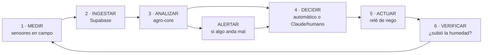
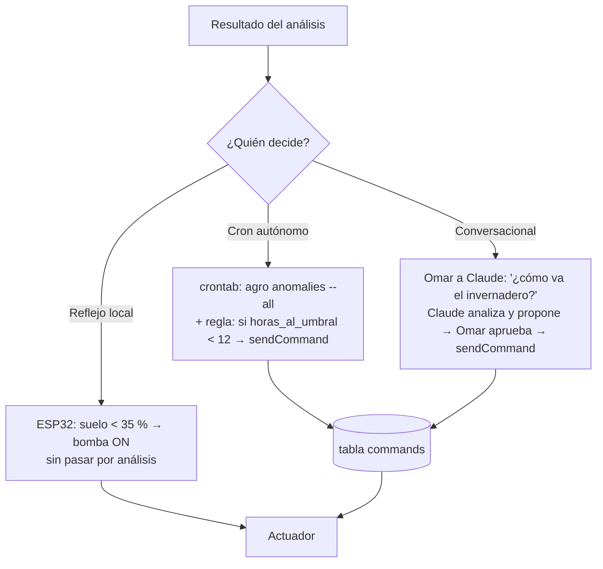
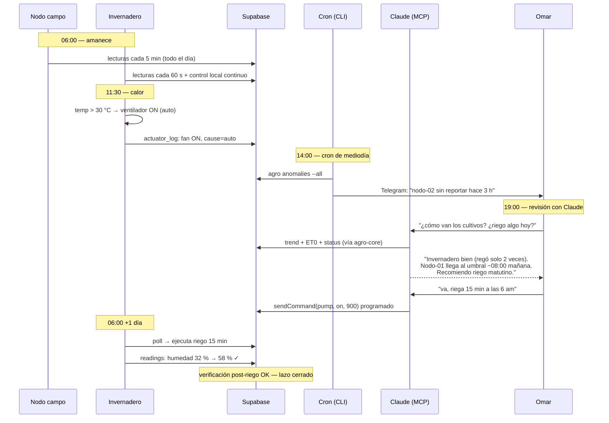

# 08 · Ciclo Completo: del Monitoreo al Riego

Este documento describe el ciclo cerrado de punta a punta — cómo una gota de agua termina cayendo en el cultivo a partir de una lectura de sensor — integrando todas las piezas de los docs 01–07.

## El lazo cerrado

El sistema tiene **dos lazos que operan en paralelo**:

| Lazo | Quién decide | Latencia | Para qué |
|---|---|---|---|
| **Reflejo** (local) | El ESP32 solo, por histéresis | 10 s | Mantener el cultivo vivo aunque no haya internet, ni Claude, ni nadie |
| **Inteligente** (análisis) | agro-core + Claude/humano/cron | Minutos–horas | Optimizar: regar *antes* de llegar al límite, detectar fugas, ajustar por clima |

El reflejo nunca depende del inteligente. El inteligente afina al reflejo.

## Ciclo detallado, paso a paso

### 1 · Medir

- **Nodo de campo** (`firmware/nodo-sensor`): despierta cada 5 min, 3 muestras promediadas, valida rangos físicos, deep sleep.
- **Invernadero** (`firmware/invernadero`): lee cada 10 s (necesita reaccionar), reporta a Supabase cada 60 s.
- Si no hay red: el nodo de campo bufferea hasta 100 lecturas en NVS con `offline_delay_s`; el invernadero sigue controlando localmente sin reportar.

### 2 · Ingestar

- `POST /rest/v1/readings` con anon key. RLS solo permite insertar (doc 04).
- Timestamps del servidor; el buffer offline reconstruye tiempos con `offline_delay_s`.

### 3 · Analizar (agro-core, doc 05)

Sobre los datos acumulados, el núcleo calcula:

- **Tendencia**: pendiente de humedad por regresión lineal → "a este ritmo, el nodo-01 llega al umbral en 14 horas"
- **Evapotranspiración** (Hargreaves con temp min/max) → días calurosos y secos adelantan la predicción
- **Anomalías**: sensor congelado, gaps de transmisión, batería baja, z-score
- **Consumo de riego** (`actuatorHistory`): si el invernadero regó 3× su mediana diaria → posible fuga o sensor de humedad fallido

### 4 · Decidir

Tres caminos, del más autónomo al más supervisado:

### 5 · Actuar

- El comando viaja por la tabla `commands` (pending → executed, doc 07).
- El ESP32 lo ejecuta con las **protecciones siempre activas**, decida quien decida: máx 15 min de bomba continua, 30 min de espera entre riegos, timeout de modo manual.
- Todo encendido/apagado queda en `actuator_log` con su causa: `auto`, `manual` o `timeout`.

### 6 · Verificar (cerrar el lazo)

La verificación es lo que separa un sistema de riego de un sistema *confiable*:

- Tras un riego, la humedad del suelo debe subir en los siguientes 15–30 min. **Si la bomba corrió y la humedad no subió** → alerta crítica: bomba fallida, manguera rota, tinaco vacío o sensor desconectado.
- Esta regla vive en `detectAnomalies` como verificación post-riego: correlacionar `actuator_log` (pump ON→OFF) con la serie de `soil_moisture` posterior.

## Un día en la vida del sistema

## Qué pasa cuando algo falla

| Falla | Comportamiento | Quién avisa |
|---|---|---|
| Se cae el internet del rancho | Invernadero sigue regando por reflejo local; nodo de campo bufferea | Cron detecta gap > 30 min → Telegram |
| Sensor de humedad se desconecta | Lecturas `null` → la bomba NO enciende en auto (sin dato no hay riego a ciegas); histéresis queda en último estado seguro | `sensor_anomaly` |
| Bomba fallida / tinaco vacío | Riego "ejecutado" pero humedad no sube | Verificación post-riego → alerta crítica |
| Sensor atascado en valor fijo | Riego infinito imposible: timeout 15 min + cooldown 30 min | Sensor congelado ≥ 12 ciclos |
| Batería del nodo baja | Sigue operando hasta ~3.0 V | `low_battery` a partir de 3.4 V |
| Comando manual olvidado | Vence su `duration_s` (o 1 h) → regresa a auto solo | `actuator_log` registra el timeout |

## Métricas del ciclo (para el dashboard futuro)

- **Litros/minutos de riego por día** por nodo (de `actuatorHistory`) — la métrica de costo
- **Tiempo en zona óptima de humedad** (% del día entre umbral y saturación) — la métrica de calidad
- **Riegos por reflejo vs programados** — si el reflejo dispara mucho, los umbrales o el horario del riego programado están mal calibrados
- **Latencia de alertas** — tiempo entre anomalía y notificación en Telegram
